# 🏫 CampusConnect


---

## 📖 About the Project
**CampusConnect** is a dedicated cross-platform social media application built using **React Native** and **Expo**, exclusively designed for the students of **Marwadi University**.  
The project's vision is to create a unified digital space where students can **connect, collaborate, and stay updated** with all campus happenings — from academic events to extracurricular opportunities.

> 🌐 **Built to Scale** — Although currently live for **Marwadi University**, CampusConnect is **architecturally designed to support any university**. With a simple configuration change in the codebase (updating the allowed email domain), the entire platform can be deployed for any institution worldwide.

---

## 🔐 Secure Access
CampusConnect ensures **secure authentication through official university email IDs**.  
Currently configured for Marwadi University (e.g., `@marwadiuniversity.ac.in`).
```js
// Easily configurable for any university — just update the allowed domain:
const ALLOWED_DOMAIN = "@marwadiuniversity.ac.in"; // change to your university's domain
```

> 🔧 Want to deploy CampusConnect for your university? Just swap the domain — everything else works out of the box.

---

## 🌟 Core Features
- ✏ **Create & Share Posts** – Express thoughts, ideas, and updates with the campus community  
- 💬 **Engage Socially** – Like, comment, follow peers, and bookmark posts — all in real time  
- 🎉 **Campus Events Section** – Explore placements, hackathons, workshops, seminars & more  
- 🔔 **Real-Time Notifications** – Stay informed about likes, follows, and comments  
- 👤 **Profile Customization** – Edit and personalize profiles using animated modals  
- 🖼 **Media Uploads** – Upload and share images directly from your device  
- 📚 **Student-Centric Feed** – Stay connected with all campus-related activities  
- 💬 **Real-Time Direct Messaging** – Chat privately with fellow students  
- 🛒 **Student Marketplace** – Buy and sell items within the campus community  
- 🔍 **Lost & Found** – Report and find lost items across campus  

---

## ⚙️ Tech Stack
| Category | Technology Used |
|-----------|----------------|
| **Frontend** | React Native + Expo |
| **Authentication** | Clerk (domain-restricted to university email) |
| **Backend** | Convex (real-time data handling) |
| **Navigation** | Tab & Stack Navigators |
| **UI Framework** | React Native Components + Custom Styling |
| **Storage** | Cloud & Local Caching |
| **Notifications** | In-App Notification System |

---

## 📱 Screenshots

### 🔐 Authentication Flow

<table>
  <tr>
    <td align="center">
      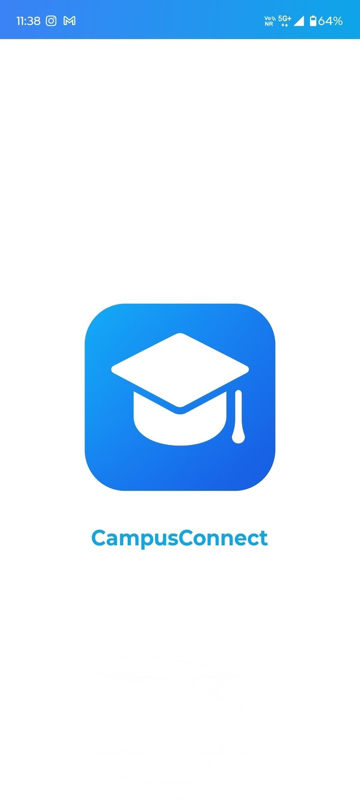<br/>
      <b>Splash Screen</b><br/>
      <sub>App launch screen with branding</sub>
    </td>    
    <td align="center">
      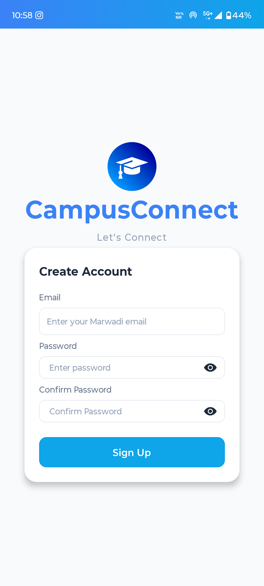<br/>
      <b>Create Account</b><br/>
      <sub>Creating account via university email ID</sub>
    </td>
    <td align="center">
      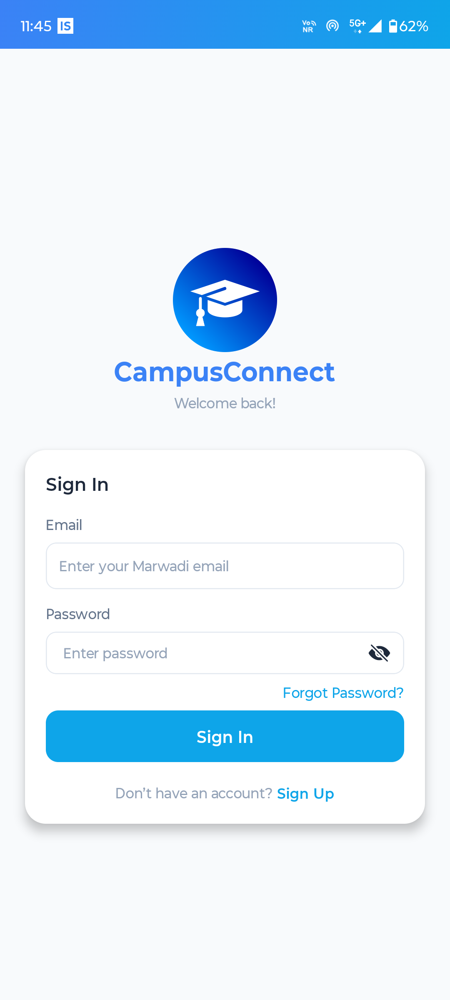<br/>
      <b>Login</b><br/>
      <sub>Secure login via university email ID</sub>
    </td>
    <td align="center">
      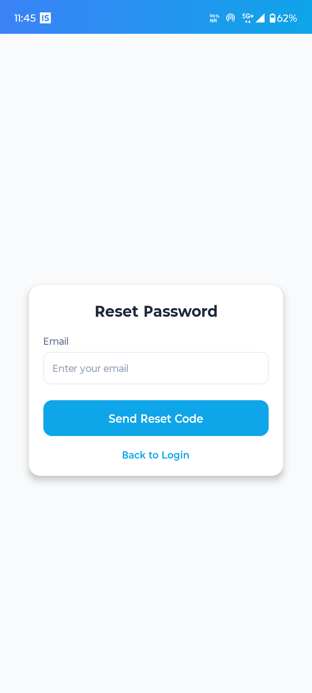<br/>
      <b>Forgot Password</b><br/>
      <sub>Password recovery with email verification</sub>
    </td>
    <td align="center">
      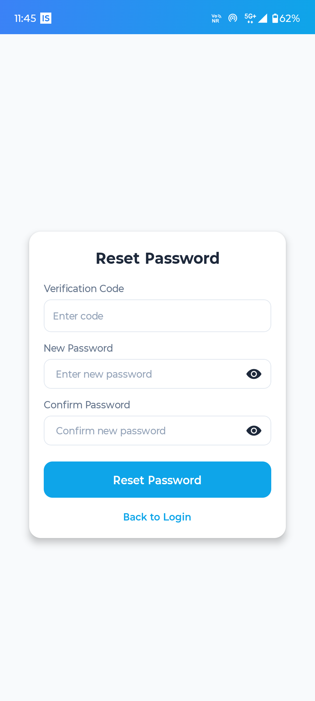<br/>
      <b>Reset Password</b><br/>
      <sub>Set a new password securely</sub>
    </td>
  </tr>
</table>

---

### 🏠 Home & Feed

<table>
  <tr>
    <td align="center">
      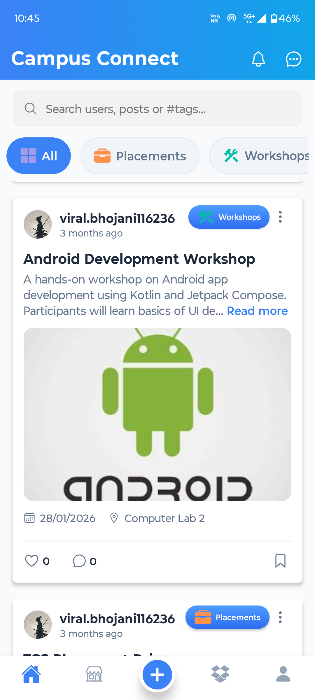<br/>
      <b>Home Feed</b><br/>
      <sub>Campus-wide post feed with real-time updates</sub>
    </td>
    <td align="center">
      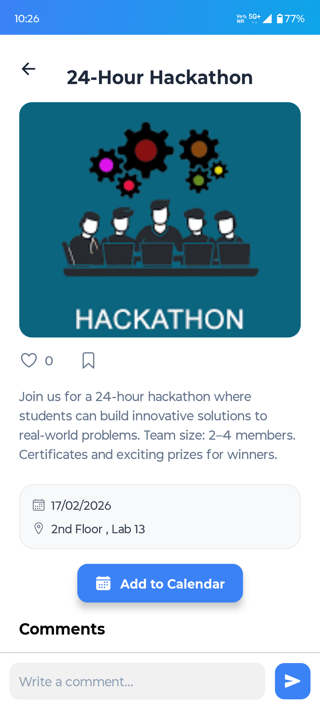<br/>
      <b>Post Detail</b><br/>
      <sub>Full post view with comments and likes</sub>
    </td>
    <td align="center">
      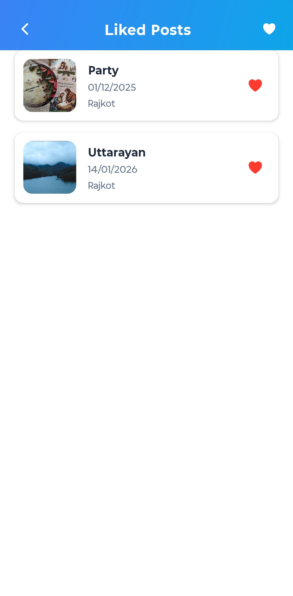<br/>
      <b>Likes</b><br/>
      <sub>See who liked your post</sub>
    </td>
    <td align="center">
      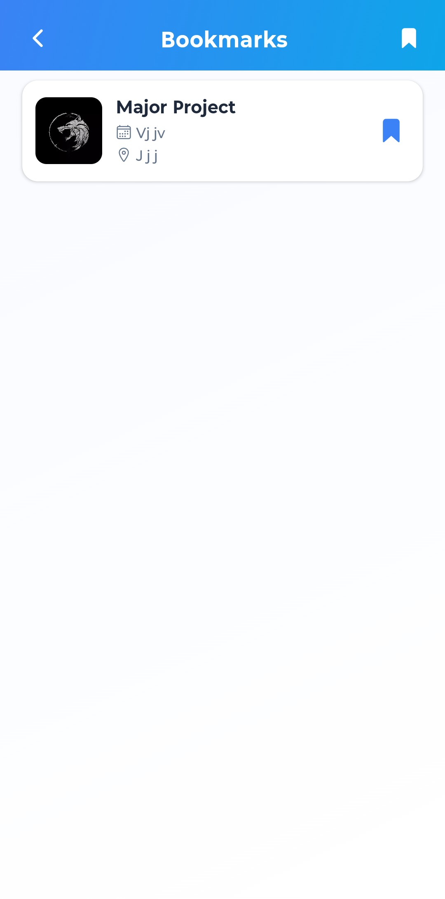<br/>
      <b>Bookmarks</b><br/>
      <sub>Save and revisit your favourite posts</sub>
    </td>
  </tr>
</table>

---

### 💬 Messaging

<table>
  <tr>
    <td align="center">
      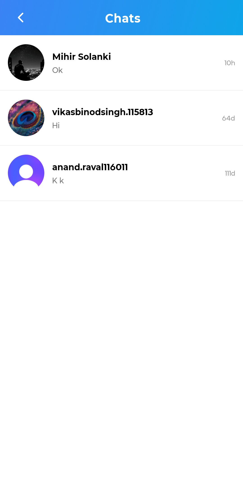<br/>
      <b>Chat List</b><br/>
      <sub>All active conversations at a glance</sub>
    </td>
    <td align="center">
      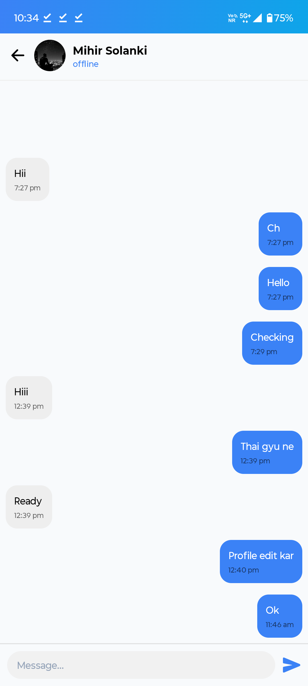<br/>
      <b>Chat Screen</b><br/>
      <sub>Real-time direct messaging between students</sub>
    </td>
  </tr>
</table>

---

### 🛒 Marketplace

<table>
  <tr>
    <td align="center">
      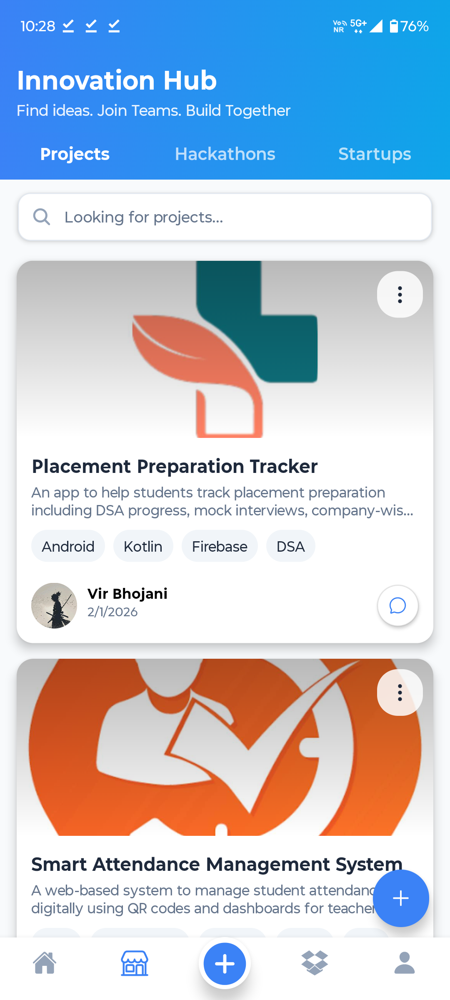<br/>
      <b>Marketplace</b><br/>
      <sub>Browse items listed by fellow students</sub>
    </td>
    <td align="center">
      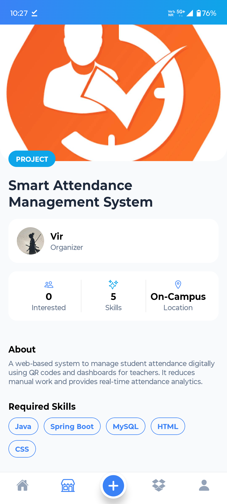<br/>
      <b>Item Detail</b><br/>
      <sub>Full details, price, and seller info</sub>
    </td>
    <td align="center">
      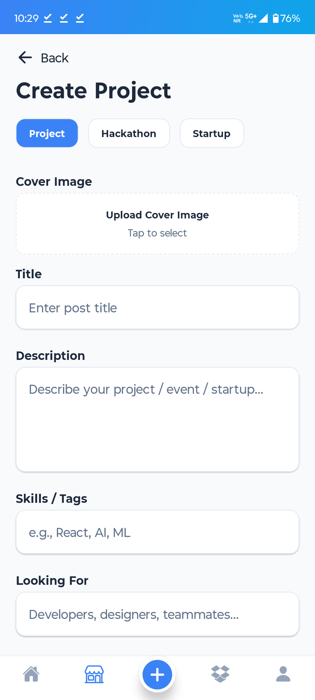<br/>
      <b>Create Listing</b><br/>
      <sub>List your items for sale on campus</sub>
    </td>
  </tr>
</table>

---

### 🔍 Lost & Found

<table>
  <tr>
    <td align="center">
      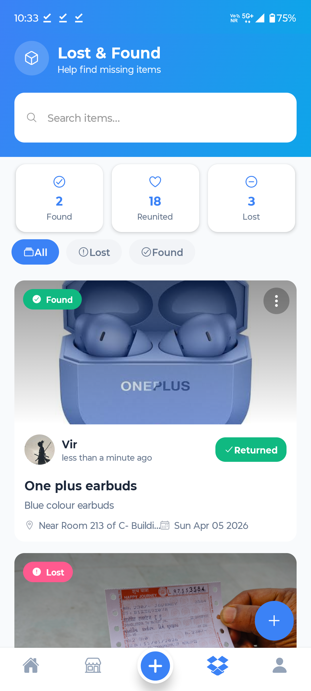<br/>
      <b>Lost & Found</b><br/>
      <sub>Browse reported lost or found items on campus</sub>
    </td>
    <td align="center">
      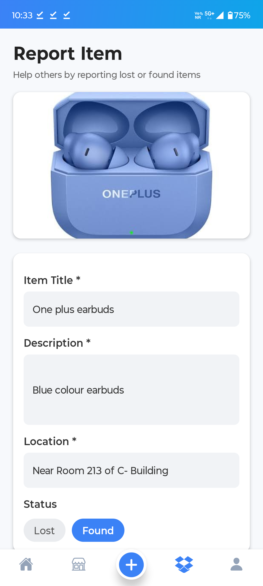<br/>
      <b>Report Item</b><br/>
      <sub>Post a lost or found item with details</sub>
    </td>
  </tr>
</table>

---

### 👤 Profile & Social

<table>
  <tr>
    <td align="center">
      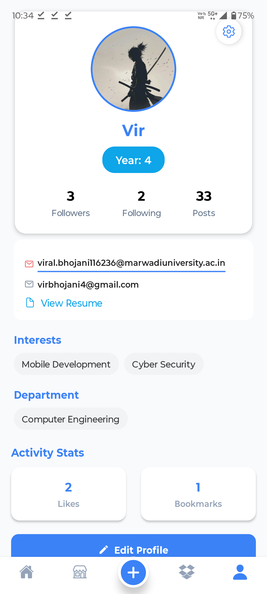<br/>
      <b>My Profile</b><br/>
      <sub>View and edit your personal profile</sub>
    </td>
    <td align="center">
      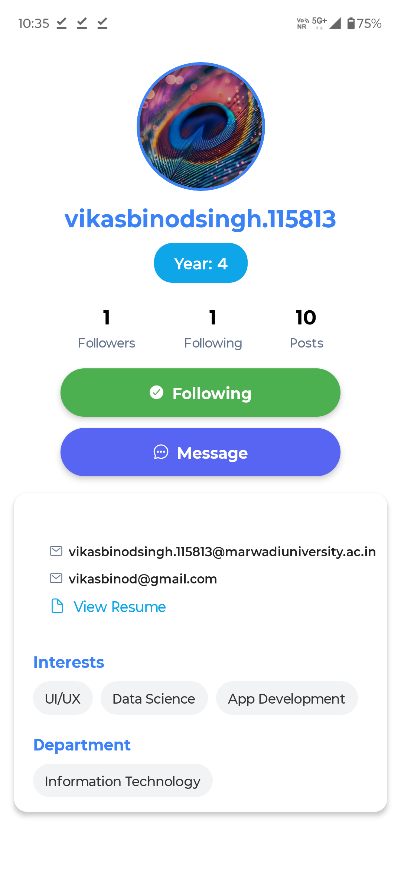<br/>
      <b>Other User's Profile</b><br/>
      <sub>View peers' profiles and follow them</sub>
    </td>
    <td align="center">
      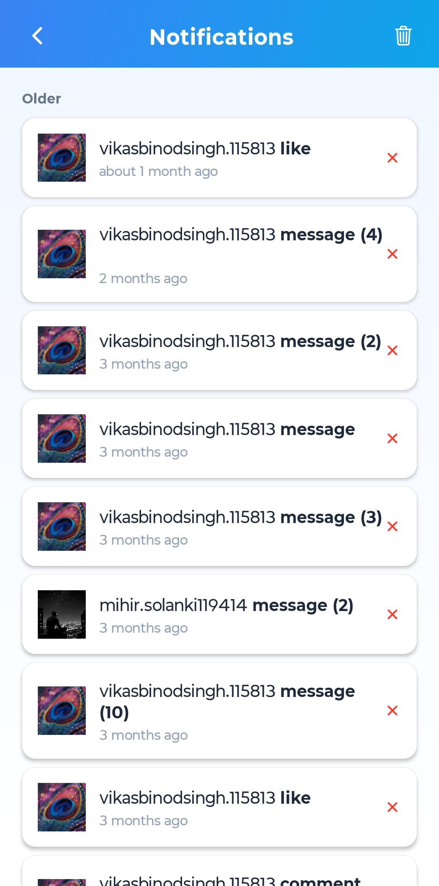<br/>
      <b>Notifications</b><br/>
      <sub>Real-time alerts for likes, comments & follows</sub>
    </td>
    <td align="center">
      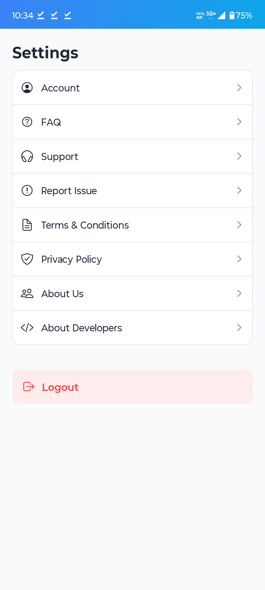<br/>
      <b>Settings</b><br/>
      <sub>Manage account preferences and app settings</sub>
    </td>
  </tr>
</table>

---

## 📱 App Structure
🧭 **10 Core Screens**
- Splash Screen
- Auth Screen (Login / Forgot Password / Reset Password)
- Home Feed Screen
- Post Detail Screen
- Bookmarks Screen
- Notifications Screen
- Chat List & Chat Screen
- Marketplace (Browse / Detail / Create)
- Lost & Found (Browse / Report)
- Profile Screen (Own & Other Users)
- Settings Screen

---

## 🚀 Additional Highlights
- 🎨 **Custom Fonts, Themes, and App Icons**  
- ⚡ **Performance Optimization & Smooth Navigation**  
- 🔄 **Webhooks Integration for Real-Time Updates**  
- 💻 **Cross-Platform Development** — No Mac required  
- 🌐 **Multi-University Ready** — Deployable for any institution with a single config change  

---

## 🎯 Vision
By combining **social connectivity** with a **secure, university-exclusive environment**,  
CampusConnect represents a perfect blend of **innovation, technical skill, and practicality**.  
It serves as a **central hub for student engagement, collaboration, and opportunity discovery**,  
aligning seamlessly with **Marwadi University's digital transformation** and community-driven growth initiatives.

> 💡 The long-term vision is to expand CampusConnect into a **nationwide university network** — where every institution gets its own secure, private campus community, all powered by the same platform.

---

## 🧑‍💻 Developers
- **Project Name:** CampusConnect  
- **Built With:** ❤️ React Native, Expo, Convex, and Clerk  
- **Institution:** Marwadi University  
- **Team:** Vir, Vikas Singh, Aryan Bhojani

---

> _Empowering Marwadi University students to connect, collaborate, and grow together — one post at a time._
